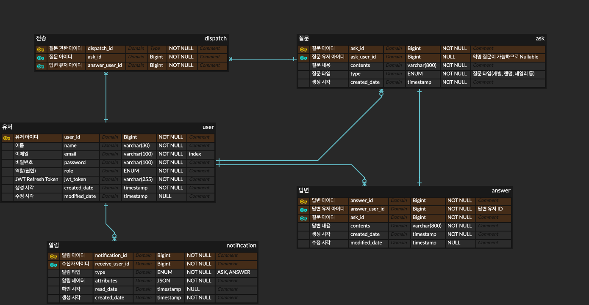

# Asker

유저간 질문을 기반으로 운영되는 SNS

- [V1](#v1)
- [V2](#v2)

<br />

## V1

V1에서는 최소 기능을 구현합니다.

유저가 다른 유저(로그인, 비로그인 사용자)에게 질문을 받고, 그에 대한 답변을 SNS(Twitter)에 공유하는 것이 V1의 핵심 기능입니다.

<br />

### ERD



#### 알림 테이블

**args(JSON 타입 컬럼)**

1. 알림 `type`이 `ASK`인 경우
   ```json
   {
      "ask_id": 1,
      "ask_user_name" : "질문 유저 이름"
   }
   ```
2. 알림 `type`이 `ANSWER`인 경우
   ```json
   {
      "answer_id": 1,
      "answer_user_name" : "답변 유저 이름"
   }
   ```

<br />

### 주요 기능

### V1

#### 유저

1. 회원가입은 Email, Email 인증을 통해 가능합니다.
2. 사용자가 회원가입을 하게 되면 **공개 페이지**와 **비공개 페이지**를 갖습니다.
    - **공개 페이지(피드)**
        - 유저가 현재까지 답변한 내역이 보이는 페이지입니다.
        - 비로그인 유저에게도 공개된 페이지입니다.
        - 답변을 삭제할 수 있습니다.
            - 답변 삭제 시, 해당 질문은 다시 유저의 비공개 페이지에서 확인 가능합니다.
    - **비공개 페이지(질문함)**
        - 특정 유저에게 들어온 질문 목록을 조회할 수 있는 페이지
        - 로그인 유저 개인만 비공개 페이지에 접근이 가능하며, 질문 목록을 조회할 수 있습니다.
            - 비로그인 유저, 타 로그인 유저 조회 불가
        - 질문을 삭제할 수 있습니다.

#### 질문

1. 유저의 공개 페이지의 입력 폼을 통해 해당 유저에게 질문을 할 수 있습니다.
    - 질문은 익명으로 이루어집니다.
    - 로그인 유저라도 익명으로 질문을 보내게 됩니다.
        - 다만 로그인 유저의 경우 질문에 답변이 달렸을 때 알림을 받을 수 있습니다.

#### 알림

1. 로그인 유저의 경우, 질문에 답변이 달렸을 때 알림 내역 페이지에서 답변을 확인할 수 있습니다.

#### 공유

1. 답변 시 SNS 공유 여부를 선택할 수 있습니다.
    - 공유 선택 후 답변을 하는 경우 연결된 SNS에 링크를 공유하게 됩니다.
    - V1에서는 Twitter 공유만 가능합니다.

#### 검색

1. 키워드로 전체 유저의 공개 답변을 검색할 수 있습니다.

<br />

### API v1

#### 인증/인가

1. **회원 가입**
    - `POST /auth/join`
        ```json
        {
          "name": "user",
          "email": "user@gmail.com",
          "password": "1234567890"
        }
        ```
2. **로그인**
    - `POST /auth/login`
    - v1에서는 OAuth 보다 Email 가입 우선 구현
        ```json
        {
          "email": "user@gmail.com",
          "password": "1234567890"
        }
        ```
    - 로그인 ID, Password 인증 시
        - JWT Access Token 발급(1시간)
        - JWT Refresh Token 발급(1주일) - Redis

#### 유저

1. **유저 정보 조회**
    - `GET /users/{userId}`
    - JWT Authorization 후 유효성 통과 시 조회

#### 질문

1. **특정 유저에게 질문**
    - `POST /asks`
      ```json 
        {
          "user_id": 1,
          "contents": "질문 내용"
        }
      ```
2. **특정 유저에게 들어온 질문 목록 조회**
    - `GET /asks?userId={userId}&sort={sortType}`
    - JWT Authorization 후 유효성 통과 시 조회
    - `sortType`
        - DESC(최신 순서) - sortType 없을 때 기본값
        - ASC(들어온 순서)

#### 답변

1. **답변 하기**
    - `POST /answers`
    - JWT Authorization 후 유효성 통과 시 조회
   ```json
   {
      "ask_id": 1,
      "contents": "답변 내용",
      "except": "질문 내용 앞 20글자"
   }
   ```
2. **특정 유저의 답변 목록 조회**
    - `GET /answers/userId={userId}&sort={sortType}`
    - `sortType`
        - DESC(최신 순서) - sortType 없을 때 기본값
        - ASC(들어온 순서)
    - 권한 검증 X, 모든 접속자에게 공개

3. **특정 답변 조회(공유 등)**
    - `GET /answers/{answerId}`

#### 알림

Kafka, Redis pub/sub, SSE 구현

1. 알림 내역 확인
    - `GET /notifications`
    - JWT Authorization 후 유효성 통과 시 해당 로그인 유저 정보로 조회

#### 검색

1. 단어 검색
    - `/search?keyword={keyword}`

<br />

### V2

#### 유저

1. OAuth 회원가입 기능
    - Google
    - Twitter

#### 질문

1. 로그인 유저의 경우 불특정 다수에게 질문을 할 수 있습니다.
    - 최대 몇 명까지 답변을 받을지 지정할 수 있습니다.
2. 전체 유저에게 하루 한 번 데일리 질문을 발송합니다.

#### 답변

1. 답변 시, 해시태그를 설정할 수 있습니다(해시태그 방식은 미정입니다.)
    - ? 정해진 해시태그를 제공합니다.
    - ? 유저가 자유롭게 해시태그를 생성할 수 있도록 합니다.

#### 검색

1. 해시태그 검색을 할 수 있습니다.
    - 답변 시 유저가 설정한 해시태그 기반으로 답변을 검색할 수 있습니다.

<br />


---

### 주요 기술 스택

| Name           | 
|----------------|
| Spring Boot    |
| Docker         |
| Elastic Search |

#### 라이브러리

| Name            | Version       | 
|-----------------|---------------|
| Spring Boot     | 3.1.5         |
| Spring Security | 6.1.5         |
| JPA(Hibernate)  | 3.1.0(6.2.13) |
| MySQL Driver    | 8.0.33        |

#### Database

| Name  | Version | 
|-------|---------|
| MySQL | 8.1.0   |
| Redis | 7.2.1   |

---

#### 1218

처음에 기획했던 내용 V1 중 실시간 알림 기능은 구현하지 못했습니다.
데이터 저장, 조회는 구현했으나 SSE를 이용하는 부분은 미완이라 아쉽습니다.

이번 프로젝트를 5주간 진행하면서, 많은 부분을 배웠습니다.
사실 지금의 기획에서는 멀티 모듈일 이유가 없다는 점도 이해하게 되었고,
어떤 경우에 멀티 모듈로 구조를 잡으면 좋을지에 대해 여러 생각을 해볼 수 있었습니다.

프로젝트 종료 이후에도 다음 부분은 계속해서 공부하며 보완해 나가려 합니다.
5주 동안 질문이 미흡함에도 자세하게 답변 해주신 멘토님께 감사드립니다!
정말 많은 도움 되었습니다.

- OAuth
- Redis Pub/Sub + SSE
- EC2 배포

이 부분은 계속 공부해 나가면서 추가해보려고 합니다. 감사합니다!
